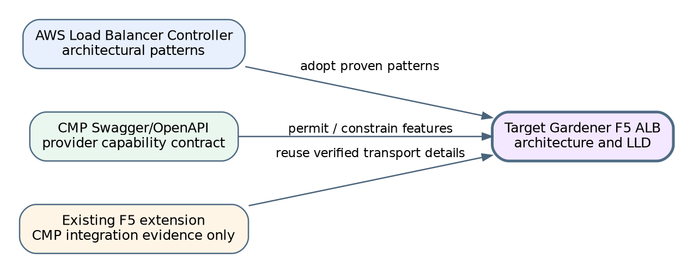
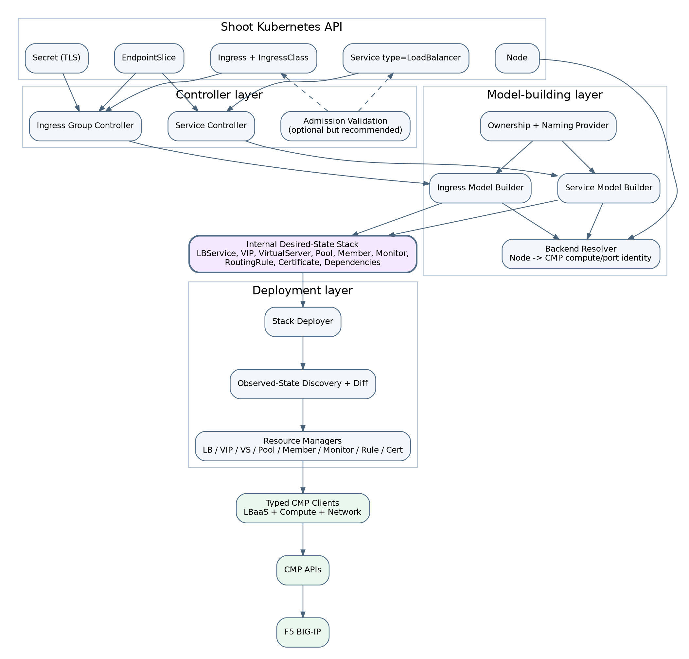
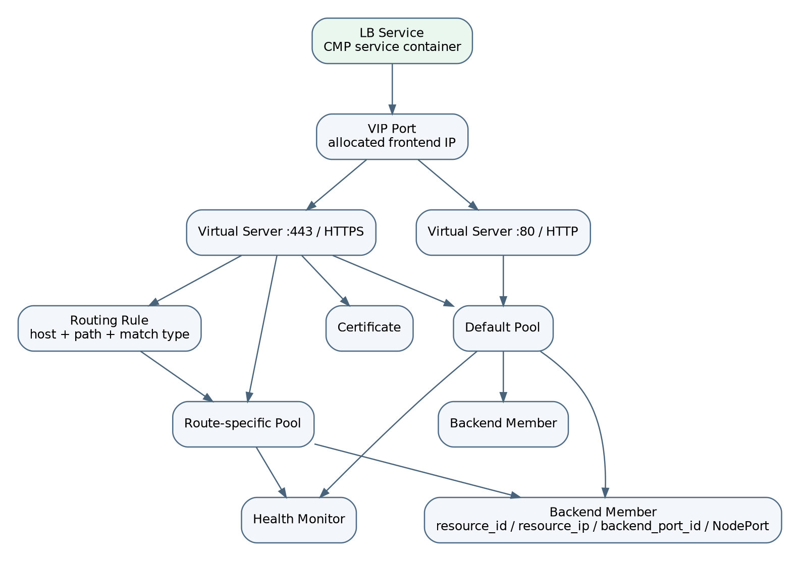
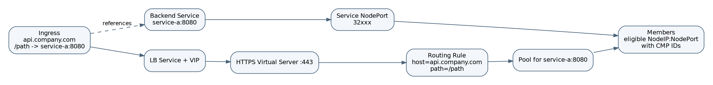
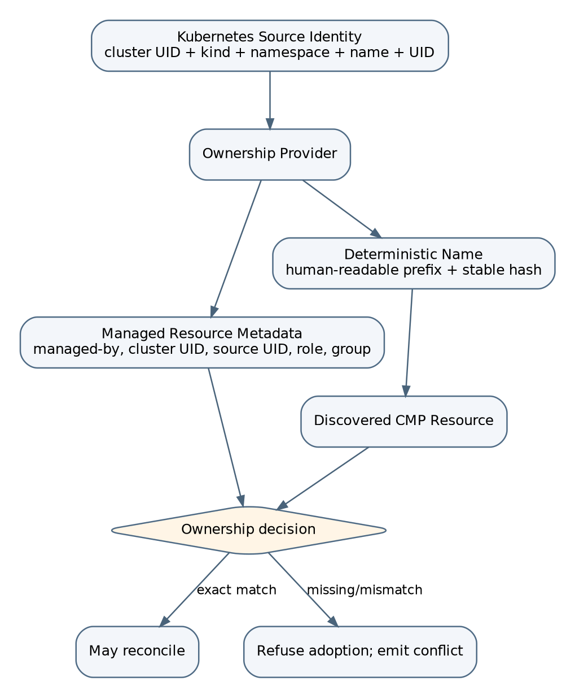
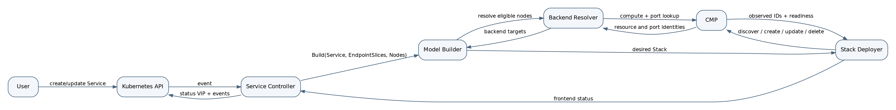

# Gardener F5 Application Load Balancer Extension
## Part 1 - Architecture Basis, Capability Mapping, and Target Solution

**Document status:** Target design baseline  
**Design stance:** Greenfield architecture derived from AWS controller patterns and constrained by verified CMP capabilities.  
**Not an assessment of the current implementation.**

---

## 1. Purpose and design method

This part establishes the architectural basis and the target solution for a Gardener extension that provides application load balancing through CMP/F5 for Shoot clusters.

The design uses three inputs with deliberately different authority:

1. **AWS Load Balancer Controller repository** - architectural reference for controller decomposition, model building, resource graphs, deployers, finalizers, event fan-out, ownership tracking, and idempotent reconciliation.
2. **CMP Swagger/OpenAPI** - authoritative capability contract for what CMP can provision on F5.
3. **Existing Gardener F5 extension repository** - evidence of CMP endpoint structure, authentication headers, request transport, and response handling. It is not the architectural baseline.

The resulting architecture is therefore not a copy of AWS and not a rewrite of the current extension. It is a Gardener-specific controller architecture that adopts the AWS patterns that remain valid when mapped to CMP.



### 1.1 Governing decision rule

For every Kubernetes load-balancing capability:

```text
Kubernetes requirement
        -> AWS implementation pattern
        -> CMP capability verification
        -> F5 extension decision

CMP fully supports it    -> implement
CMP supports a subset    -> implement the supported subset and validate explicitly
CMP does not support it  -> reject or defer; never silently approximate
```

---

## 2. Repository-derived architectural findings

### 2.1 Patterns adopted from AWS Load Balancer Controller

The AWS repository confirms a consistent architecture across Service and Ingress reconciliation:

- Service and Ingress have separate reconciliation entry points.
- Controllers are orchestration boundaries: fetch object, build model, deploy stack, update status, and manage finalizers.
- Service and Ingress each use a model builder.
- The model is an in-memory resource stack with typed resources and dependencies.
- Deployment is delegated to resource-specific managers rather than implemented in controllers.
- Ingress is reconciled as a group, enabling multiple Ingress objects to share one frontend when group semantics permit it.
- Dependent-resource events are mapped back to owning Service or Ingress reconciliation keys.
- Finalizers protect provider cleanup.
- Provider resource tracking is explicit and is used for discovery, ownership, and safe deletion.

Evidence in the supplied repository includes:

- `controllers/service/service_controller.go`
- `controllers/ingress/group_controller.go`
- `pkg/service/model_builder.go`
- `pkg/ingress/model_builder.go`
- `pkg/model/core/resource.go`
- `pkg/model/core/stack.go`
- `pkg/deploy/elbv2/*_manager.go`

These are architectural patterns, not AWS API contracts. They can be retained while replacing AWS ELBv2 resources with CMP/F5 resources.

### 2.2 CMP capabilities verified from Swagger

The supplied CMP Swagger exposes both a coarse load-balancer API and a decomposed LB Service API. The target controller shall use the decomposed API because it maps naturally to a desired-state resource graph.

Verified capabilities include:

- LB Service creation and deletion, including flavor, network, VPC, labels, and optional HA.
- VIP allocation and deletion under an LB Service.
- Virtual Server create, get, list, patch, and delete.
- Protocol and frontend port configuration.
- Routing algorithm configuration.
- TLS certificate upload, attachment, and deletion.
- X-Forwarded-For and HTTP-to-HTTPS redirect flags.
- Cookie and other persistence settings.
- Multiple pools under a Virtual Server.
- Default-pool designation.
- Pool member add, update, delete, health query, and operating-state change.
- Health monitor create, update, list, and delete.
- Host/path routing rules that reference a Virtual Server pool.
- Network-port search by IP, enabling resolution of `backend_port_id`.
- Labels and label-based LB lookup.

The Swagger also exposes the exact hierarchy required for application Ingress:

```text
LB Service
  -> VIP
     -> Virtual Server
        -> Pool(s)
           -> Member(s)
           -> Monitor(s)
        -> Routing Rule(s)
        -> Certificate(s)
```

### 2.3 Existing extension evidence retained

The existing repository confirms practical CMP integration details that are reusable below the architecture boundary:

- organisation/project-scoped LBaaS paths;
- Ce-Auth/HMAC and scoped request headers;
- redirect suppression because CMP may redirect to internal service hostnames;
- TLS CA bundle and explicit insecure development mode;
- HTTP status classification, request IDs, `Retry-After`, and client-side rate limiting;
- existing calls for LB Service, VIP, and Virtual Server provisioning.

Raw `json.RawMessage` usage in that repository shall not be carried into controllers or model builders. The new typed CMP client shall encapsulate those payloads.

---

## 3. Target system boundary

The application load-balancer controller is a managed Shoot component delivered by the Gardener extension lifecycle. Gardener lifecycle reconciliation installs and configures the component; application reconciliation occurs against resources in the Shoot cluster.

The design separates two concerns:

- **Extension lifecycle plane:** deploy, upgrade, configure, and remove the application-LB controller for a Shoot.
- **Application load-balancing plane:** reconcile Shoot `Service` and `Ingress` resources into CMP/F5 resources.

The application controller is not the Gardener `Extension` actuator itself. The actuator deploys the controller and supplies provider configuration and credentials.

---

## 4. Target architecture



### 4.1 Controller layer

Two reconcilers shall be implemented:

- **Service Controller** for `Service` objects with `spec.type=LoadBalancer` and the selected load-balancer class.
- **Ingress Group Controller** for Ingresses selected by the F5 IngressClass. A single-item group is valid; grouping is an architectural capability rather than a requirement that users always share a VIP.

Controllers remain thin. Their responsibilities are:

1. Load current Kubernetes objects.
2. Check selection and deletion state.
3. Add or remove finalizers.
4. Invoke validation/model building.
5. Invoke the stack deployer.
6. Publish status, conditions, events, and metrics.
7. Return retry/requeue decisions.

They shall not build CMP request bodies or implement resource-specific CRUD.

### 4.2 Model builders

The Service and Ingress builders translate Kubernetes semantics into one provider-neutral internal stack.

The builder owns:

- annotation/config parsing;
- backend Service and port resolution;
- EndpointSlice and Node selection;
- protocol, listener, pool, monitor, persistence, and TLS decisions;
- deterministic logical IDs and dependencies;
- ownership metadata;
- feature validation against the supported capability matrix.

The builder performs read-only CMP lookups only through explicit resolver interfaces when provider identity is required. It does not mutate CMP.

### 4.3 Internal desired-state stack

The internal stack shall contain typed logical resources:

```text
Stack
  Metadata
  Resources[]
    LBService
    VIP
    VirtualServer
    Pool
    BackendMember
    HealthMonitor
    RoutingRule
    Certificate
```

Each resource has:

- a logical ID stable across reconciliations;
- desired specification;
- dependencies expressed through references;
- ownership metadata;
- no transport-specific JSON.

The stack is in memory and rebuilt on every reconciliation. Correctness must never depend on an in-memory cache surviving restart.

### 4.4 Deployment layer

A stack deployer coordinates resource-specific managers:

- `LBServiceManager`
- `VIPManager`
- `VirtualServerManager`
- `PoolManager`
- `BackendMemberManager`
- `HealthMonitorManager`
- `RoutingRuleManager`
- `CertificateManager`

Each manager performs:

1. Discover owned actual resources.
2. Match actual resources to logical IDs.
3. Compare normalized desired and observed state.
4. Create missing resources.
5. Update supported mutable fields.
6. Replace resources when immutable fields change.
7. Delete obsolete resources that are proven to be owned.
8. Return typed observed state and readiness.

The deployer orders managers by dependency and performs deletion in reverse dependency order.

### 4.5 Typed CMP clients

The client layer shall be split by provider domain:

- `LBaaSClient` - LB Services, VIPs, Virtual Servers, Pools, Members, Monitors, Rules, Certificates.
- `ComputeClient` - compute identity lookup where required.
- `NetworkClient` - network port lookup by Node InternalIP and validation of VPC/network identity.

All clients shall expose typed requests and responses and centralize authentication, headers, timeouts, rate limiting, retries permitted at the HTTP layer, request IDs, and error classification.

---

## 5. CMP/F5 resource model



### 5.1 Why the LB Service is mandatory

The LB Service is not omitted for Ingress. It is the parent CMP resource that owns the VIP and all Virtual Servers. Both Service and Ingress flows use it.

For a dedicated Kubernetes Service:

```text
Service -> LB Service -> VIP -> one Virtual Server and Pool per Service port
```

For an Ingress group:

```text
Ingress Group -> LB Service -> VIP -> HTTP/HTTPS Virtual Server(s)
                                  -> pools per backend Service/port
                                  -> host/path routing rules
```

The earlier simplified chain that began with a host name was only a traffic-routing view; it was not a provider-resource hierarchy. The correct provider hierarchy always includes the LB Service.

### 5.2 Target logical relationships

- One `LBService` owns one or more VIP ports according to future CMP constraints; the initial design uses one VIP per stack/group.
- One VIP may be referenced by multiple Virtual Servers on distinct protocol/port combinations.
- A Virtual Server has one default pool and may have additional route-specific pools.
- A routing rule selects a pool using host, path, and match type.
- A pool contains backend members and monitors.
- A certificate is uploaded under the LB Service and attached to an HTTPS Virtual Server.

---

## 6. Kubernetes-to-CMP mapping

### 6.1 Service type LoadBalancer

| Kubernetes input | Internal model | CMP/F5 resource |
|---|---|---|
| Service UID | stack ownership root | labels/name on all resources |
| Service port | frontend | Virtual Server |
| Service protocol | frontend protocol | Virtual Server protocol |
| Service NodePort | target port | pool-member port |
| eligible Node | backend target | pool member |
| Node InternalIP | target address | member `resource_ip` / address |
| CMP compute identity | provider target identity | `resource_id` / compute ID |
| CMP port found by IP | network identity | `backend_port_id` / port ID |
| health annotations/config | monitor spec | pool Health Monitor |
| allocated VIP | observed frontend | Service status |

For a multi-port Service, each port is modeled independently beneath the shared LB Service/VIP. An unchanged port must not be recreated when another port changes.

### 6.2 Ingress



| Kubernetes input | Internal model | CMP/F5 resource |
|---|---|---|
| Ingress group | shared stack ownership root | LB Service + VIP |
| HTTP listener | frontend | HTTP Virtual Server |
| HTTPS listener | frontend + TLS ref | HTTPS Virtual Server + certificate |
| host/path | route | routing rule |
| backend Service/port | backend group | Pool |
| Service NodePort | member port | Pool Member port |
| eligible Node | target | Pool Member |
| default backend | default route | default Pool |
| TLS Secret | certificate model | uploaded CMP certificate |

Ingress must not create a separate LB Service for every host or path. Pools are reused for repeated references to the same backend Service/port/configuration tuple.

### 6.3 Backend resolution

Initial target mode is **instance/node mode**, matching the connectivity model already discussed:

```text
EndpointSlice ready endpoints
       -> group by nodeName
       -> filter Nodes by readiness and traffic policy
       -> Node InternalIP + Service NodePort
       -> CMP network search-by-IP
       -> CMP compute/network identity
       -> BackendMember
```

A target includes at least:

```text
Kubernetes node UID
node InternalIP
NodePort
CMP resource ID / compute ID
CMP resource type
CMP backend port ID
weight
enabled state
```

The resolver shall never invent `resource_id` or `backend_port_id`. Failure to resolve them is a typed reconciliation error and must be surfaced through an Event/Condition.

---

## 7. Capability matrix and decisions

| Kubernetes / ALB capability | AWS architectural reference | Verified CMP support | Target decision |
|---|---|---|---|
| Service type LoadBalancer | service controller + model builder + stack deployer | LB Service, VIP, VS, pools/members | Implement |
| Multi-port Service | multiple listeners/target groups in one stack | multiple VS under LB Service | Implement one VS/pool per port |
| Ingress host routing | listener rules | host/path routing-rule API | Implement |
| Ingress path routing | listener rules | path + match_type | Implement supported path match types |
| Ingress groups/shared frontend | ingress group reconciler | one LB Service/VIP with multiple rules/pools | Implement explicit group key and compatibility validation |
| Default backend | default action | pool `set-default` API | Implement |
| TLS termination | certificate discovery and listener certs | certificate upload and VS attachment | Implement with Secret watch and ownership |
| HTTP to HTTPS redirect | redirect action | `redirect_https` | Implement |
| X-Forwarded-For | listener attributes | `x_forwarded_for` | Implement |
| Session persistence | target-group/listener attributes | persistence and cookie fields | Implement validated subset |
| Health monitors | target-group health checks | monitor CRUD | Implement |
| Weighted members | target configuration | member weight available in traffic-group API; node payload must be verified for VS-pool API | Mark conditional until payload schema is confirmed in integration testing |
| Source CIDRs | listener inbound CIDRs | coarse API exposes `allowed_cidrs`; decomposed VS API does not show it | Defer unless a supported decomposed endpoint is confirmed |
| Pod-IP target mode | IP target type | network reachability/API identity not yet proven | Not in initial release |
| Dual-stack VIP | IP address type | not established by supplied Swagger | Not in initial release |
| WAF integration | WAF associations | not established | Out of scope |
| Gateway API | gateway model/build/deploy | CMP primitives are compatible | Future extension after Service/Ingress baseline |
| Multi-AZ/HA | scheme/subnets/AZ | LB Service has `ha`; platform capability must be verified | Architecture-ready, release-gated by Airtel cloud support |

### 7.1 Validation behavior

The model builder remains the authoritative validator because it has the full dependency context. A validating admission webhook is recommended for fast rejection of configuration that can be checked without provider calls, such as:

- invalid annotation formats;
- unsupported protocols;
- incompatible shared-group settings;
- duplicate listener port/protocol conflicts;
- unsupported path types;
- missing TLS Secret references;
- invalid persistence combinations.

Provider-dependent checks, such as flavor availability or backend port identity, remain reconciliation-time validation.

---

## 8. Ownership, identity, and adoption



### 8.1 Who creates ownership fields

The **Ownership Provider in the model-building layer** creates ownership metadata. Controllers do not ask users to supply it, and the admission webhook does not create it.

Recommended ownership fields:

```text
managed-by       = gardener-extension-f5
cluster-uid      = <Shoot/cluster stable UID>
source-kind      = Service | IngressGroup
source-namespace = <namespace or group scope>
source-name      = <name or group key>
source-uid       = <Kubernetes UID or deterministic group UID>
resource-role    = lb-service | vip | virtual-server | pool | member | monitor | rule | certificate
logical-id       = <stable internal resource logical ID>
```

CMP labels shall carry as much of this identity as the API permits. Deterministic names provide a secondary lookup key, never sole proof of ownership.

### 8.2 Adoption rule

A discovered CMP resource may be adopted only if ownership, tenant/project, VPC/network, role, and logical ID are compatible. A same-name resource with missing or conflicting ownership causes a conflict, not mutation.

### 8.3 Finalizers

- Service finalizer protects cleanup of its dedicated stack or its binding to a shared stack.
- Ingress finalizer protects removal of its group membership and route resources.
- Group/shared resource deletion occurs only after the controller computes that no active Kubernetes member still references it.

Finalizers are added before provider creation and removed only after required owned resources/bindings are deleted or a documented abandonment policy is invoked.

---

## 9. Reconciliation algorithms

### 9.1 Service reconciliation



```text
1. Read Service.
2. If not selected, clean only previously owned resources/finalizer if necessary.
3. If deleting, build deletion stack and deploy cleanup.
4. Resolve Service ports and NodePorts.
5. Read EndpointSlices and derive nodes with ready endpoints.
6. Apply externalTrafficPolicy semantics and Node readiness filtering.
7. Resolve each node to CMP compute/network identity and backend port ID.
8. Build desired Stack.
9. Add finalizer if not present.
10. Deploy Stack in dependency order.
11. Wait/poll only for resources whose readiness is required for publication.
12. Update Service.status.loadBalancer with allocated VIP.
13. Emit Events, Conditions, metrics, and structured logs.
```

### 9.2 Ingress group reconciliation

```text
1. Resolve the group key from IngressClass and explicit group configuration.
2. Load all active and recently removed group members.
3. Validate group-wide compatibility: tenant, network, visibility, VIP policy, listener conflicts.
4. Load referenced Services, ports, EndpointSlices, Nodes, and TLS Secrets.
5. Deduplicate backend pools by backend identity and policy.
6. Build HTTP/HTTPS Virtual Servers, default pool, route pools, routing rules, monitors, and certificates.
7. Resolve node/CMP identities for each backend pool.
8. Add finalizers to active members before mutation.
9. Deploy the group Stack.
10. Update status on every active group member with the shared VIP.
11. Remove finalizers from inactive members only after their routes/bindings are absent.
```

### 9.3 Dependency order

Creation/update order:

```text
LB Service -> VIP -> Certificates -> Virtual Servers -> Pools -> Monitors -> Members -> Routing Rules -> default-pool selection
```

Deletion order is the reverse, adjusted where CMP permits parent deletion to cascade. The controller should still explicitly remove children when required for deterministic cleanup and clear error reporting.

### 9.4 Stable frontend principle

Backend membership changes shall not recreate LB Service, VIP, Virtual Server, routing rules, or unchanged pools. Managers compare their own normalized resource specs and mutate only the affected resource type.

---

## 10. Package and interface blueprint

```text
cmd/gardener-extension-f5/
  extension lifecycle manager and component registration

cmd/f5-application-lb-controller/
  Shoot controller process and dependency wiring

pkg/controllers/service/
  Service reconciler and event mapping
pkg/controllers/ingress/
  Ingress group reconciler and event mapping

pkg/model/core/
  Stack, Resource, logical IDs, references, visitors
pkg/model/f5/
  LBService, VIP, VirtualServer, Pool, Member, Monitor, Rule, Certificate

pkg/service/
  Service model builder
pkg/ingress/
  group loader, annotation merge, Ingress model builder
pkg/backend/
  EndpointSlice selection, node filtering, CMP identity resolver
pkg/ownership/
  labels, deterministic naming, adoption checks
pkg/deploy/
  stack deployer and resource managers
pkg/cmp/lbaas/
  typed LBaaS API
pkg/cmp/compute/
  typed compute lookup API
pkg/cmp/network/
  typed port/network lookup API
pkg/status/
  Service and Ingress status writers
pkg/finalizers/
  finalizer helpers
pkg/validation/
  shared semantic validation
pkg/webhooks/
  admission validation
pkg/metrics/
  controller and CMP metrics
```

Key interfaces:

```go
type ServiceModelBuilder interface {
    Build(ctx context.Context, svc *corev1.Service) (*core.Stack, error)
}

type IngressModelBuilder interface {
    Build(ctx context.Context, group ingress.Group) (*core.Stack, error)
}

type StackDeployer interface {
    Deploy(ctx context.Context, stack *core.Stack) (*ObservedStack, error)
}

type BackendResolver interface {
    ResolveNode(ctx context.Context, node *corev1.Node) (ProviderTarget, error)
}

type ResourceManager[TDesired any, TObserved any] interface {
    Reconcile(ctx context.Context, desired []TDesired, ownership Ownership) ([]TObserved, error)
}
```

The final Go interfaces may use concrete types or generics according to the repository's Go version, but package boundaries and responsibilities shall remain.

---

## 11. Error and retry contract

Errors shall be classified before returning to controller-runtime:

- **Permanent configuration error:** no rapid retry; wait for Kubernetes object change.
- **Dependency not ready:** bounded `RequeueAfter`.
- **CMP asynchronous provisioning:** poll with bounded interval and timeout state.
- **429 rate limit:** honor `Retry-After`.
- **401/403:** emit authentication/authorization condition; slow retry.
- **transport/5xx:** controller-runtime backoff.
- **404 during delete:** success.
- **ownership conflict:** permanent until user/operator resolves collision.

All mutating operations must be context-bound and idempotent. A lost response after successful creation is handled by rediscovery using ownership/logical ID before attempting another create.

---

## 12. Architecture decisions fixed by this part

1. The new application LB is a dedicated Shoot controller component installed by the Gardener extension lifecycle.
2. Service and Ingress use separate thin controllers and shared deployment infrastructure.
3. Ingress is reconciled through a group abstraction even when a group has one member.
4. Every reconciliation first builds a complete internal desired-state stack.
5. CMP mutation is performed only by resource-specific deployment managers through typed clients.
6. The decomposed `LB Service -> VIP -> Virtual Server -> Pool -> Member` CMP APIs are the primary provider model.
7. Ingress also uses an LB Service; it is never omitted from the provider hierarchy.
8. Initial backend mode is NodeIP:NodePort with Node-to-CMP compute/network identity resolution.
9. `resource_id` and `backend_port_id` come from CMP lookup, never from naming guesses.
10. Ownership is generated internally by an Ownership Provider and attached to every logical resource.
11. Names are deterministic but do not replace ownership proof.
12. Admission validation handles static user errors; reconciliation handles provider-dependent validation.
13. Backend-only changes do not recreate stable frontend resources.
14. Unsupported CMP features are rejected or deferred explicitly.

---

## 13. Source evidence used for this design

### AWS repository

- `controllers/service/service_controller.go`
- `controllers/ingress/group_controller.go`
- `controllers/service/eventhandlers/service_events.go`
- `controllers/ingress/eventhandlers/*`
- `pkg/service/model_builder.go`
- `pkg/ingress/model_builder.go`
- `pkg/model/core/resource.go`
- `pkg/model/core/stack.go`
- `pkg/deploy/elbv2/load_balancer_manager.go`
- `pkg/deploy/elbv2/listener_manager.go`
- `pkg/deploy/elbv2/target_group_manager.go`

### CMP Swagger

- `compute-swagger.json` load-balancer, virtual-server, pool, member, monitor, routing-rule, certificate, network-port endpoints.
- `network-manager.json` network/subnet/port capability context.

### Existing Gardener F5 repository

- `pkg/cmp/lbaas/client.go`
- `pkg/f5/client.go`
- `pkg/controller/lifecycle/extension_controller.go`
- `pkg/apis/f5/v1alpha1/types.go`

### Previous LLD

The useful requirements from the previously supplied LLD have been retained and refined, including thin controllers, builders, desired/observed separation, deployment managers, backend resolution, ownership, finalizers, status, failure handling, idempotency, observability, security, package design, and testing direction. Statements that assumed an unverified hierarchy or treated the existing implementation as architecture were not carried forward.

---

## 14. Scope of Part 2

Part 2 will define the complete internal desired-state model and low-level contracts: every resource struct, logical ID, dependency, normalization rule, ownership field, equality/diff rule, immutable-field replacement rule, and observed-state representation.
