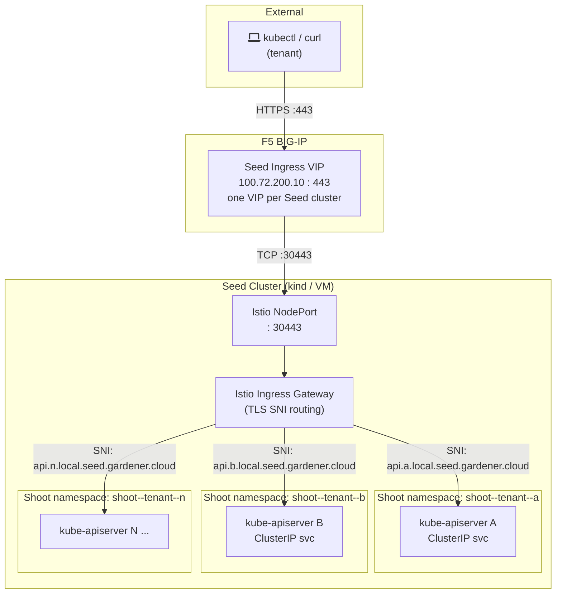
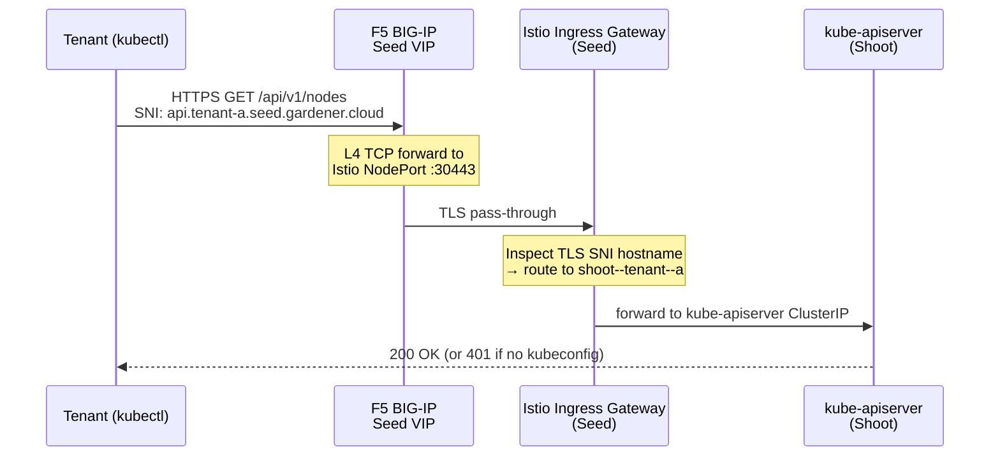
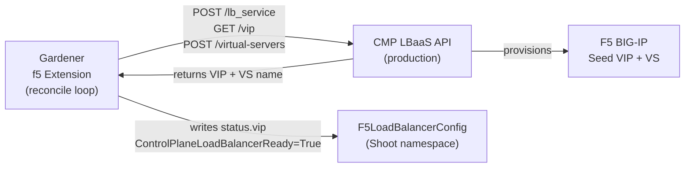
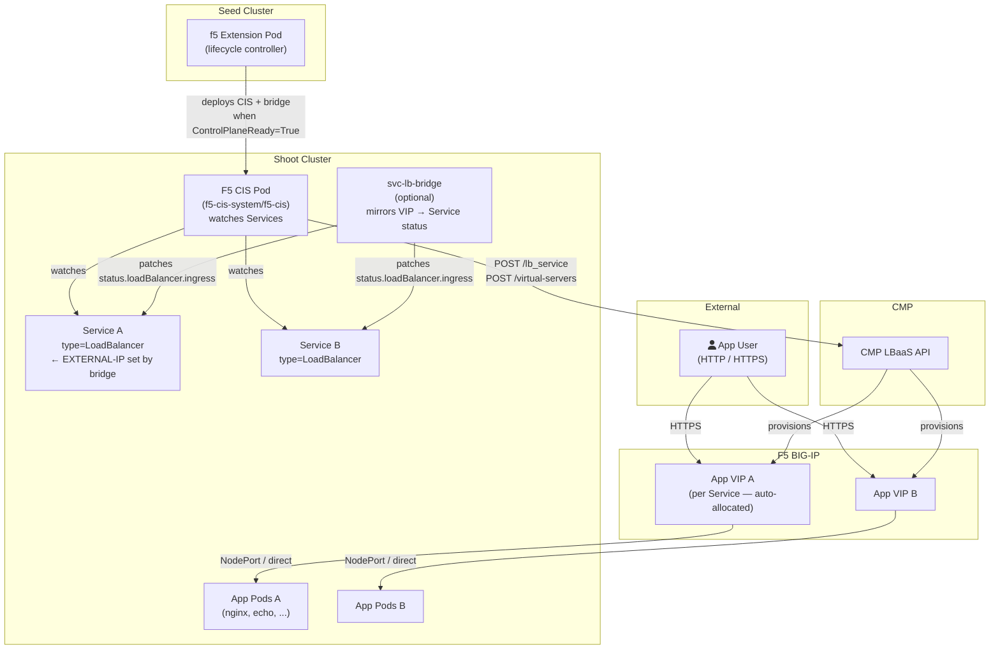
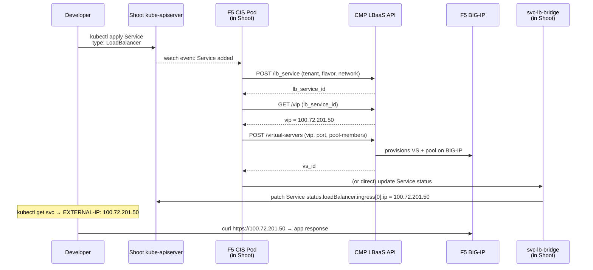
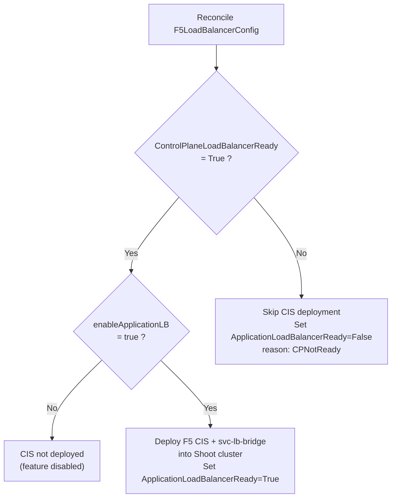
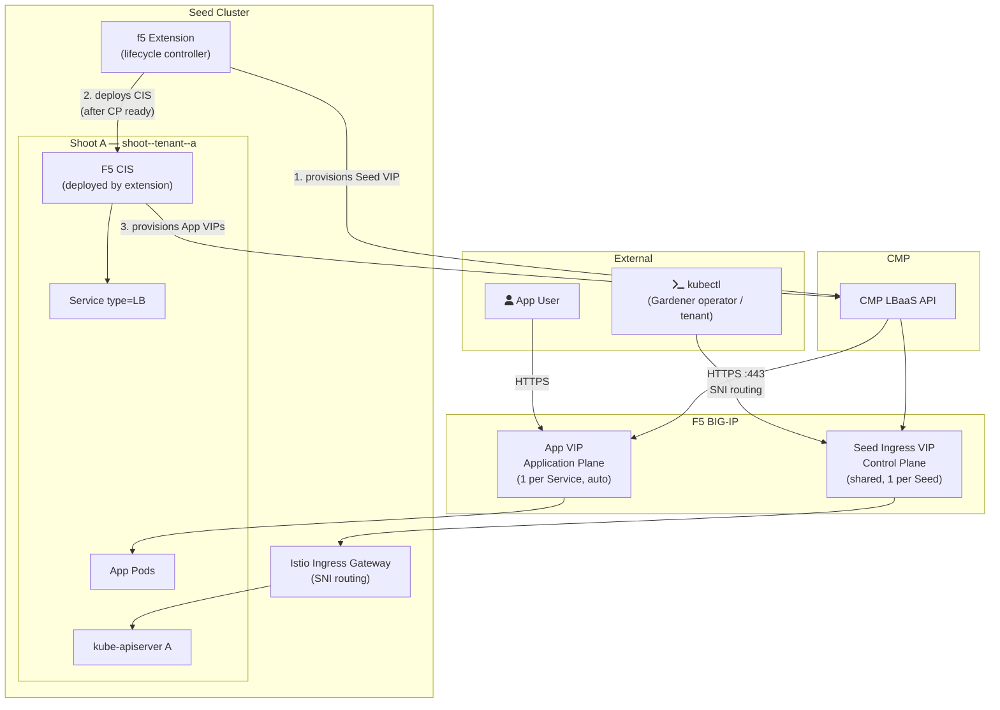

# F5 Load Balancing — Architecture Diagrams & Flows

Two planes of load balancing are managed by the `gardener-extension-f5`:

| Plane | Scope | Default | Feature Flag |
|---|---|---|---|
| **Control Plane LB** | Seed Ingress VIP (shared, one per Seed) | ✅ On | — |
| **Application Plane LB** | Per-Shoot app services via F5 CIS | ❌ Off | `enableApplicationLB: true` |
| *(Per-Shoot CP VIP)* | Dedicated VIP per kube-apiserver | ❌ Off (toggle) | TBD |

---

## 1. Control Plane Load Balancing — Seed Ingress VIP via F5

### What it is

A single F5 Virtual Server fronts the Seed cluster's Istio ingress gateway.  
All Shoot kube-apiservers on that Seed are reachable through this **one shared VIP**.  
Traffic is distinguished per-Shoot using **TLS SNI** (hostname-based routing inside Istio).

### Architecture

### Request Flow

### How the extension wires this up

> **Kind demo shortcut:** `controlPlaneReady: true` + `controlPlaneVIP: 100.72.200.20`  
> skips the CMP call — extension marks `ControlPlaneLoadBalancerReady=True` immediately.

---

## 2. Application Plane Load Balancing — F5 CIS in Shoot

### What it is

After the Shoot's control-plane VIP is ready (`ControlPlaneLoadBalancerReady=True`),  
the extension deploys **F5 CIS (Container Ingress Services)** into the Shoot cluster.  
CIS watches `Service type=LoadBalancer` objects and automatically provisions a  
**dedicated F5 Virtual Server + VIP** per application service — without any manual F5 work.

Gated by `spec.enableApplicationLB: true` in `F5LoadBalancerConfig`.

### Architecture

### Request Flow — new app Service being exposed

### Gate: Control Plane must be Ready first

---

## 3. Combined Architecture — Both Planes Together

---

## 4. Component Summary

| Component | Where it runs | Role |
|---|---|---|
| `gardener-extension-f5` | Seed cluster (`extension-gardener-extension-f5` ns) | Lifecycle controller — provisions CP VIP, deploys CIS |
| `F5LoadBalancerConfig` CRD | Seed cluster (Shoot namespace) | Config + status for one Shoot's LB wiring |
| `Istio Ingress Gateway` | Seed cluster (`istio-ingress` ns) | SNI-based routing from Seed VIP to per-Shoot kube-apiservers |
| `F5 CIS` | **Shoot cluster** (`f5-cis-system` ns) | Watches `Service type=LB`, calls CMP to provision App VIPs |
| `svc-lb-bridge` | **Shoot cluster** | Mirrors allocated VIP into `Service.status.loadBalancer.ingress` |
| `CMP LBaaS API` | External (production infra) | Allocates VIPs, creates VS + pools on F5 BIG-IP |
| `F5 BIG-IP` | External (hardware/VELOS) | Data-plane: routes real traffic to pool members |
